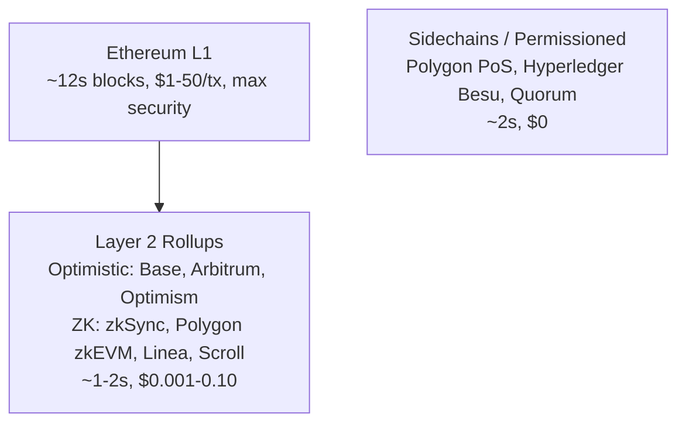

# 02 — EVM stack

Ethereum Virtual Machine + tooling stack for cash-management products.

## EVM

- Stack-based VM, deterministic, gas-metered
- Same bytecode runs across Ethereum L1, all EVM L2s, EVM-compatible permissioned chains
- Solidity = dominant language; Vyper = security-focused alternative
- Bytecode portability = same Solidity contract on Ethereum, Base, Polygon, Besu

## Layers

## Key components

| Layer | Tech |
|---|---|
| Smart contract | Solidity 0.8.x · Vyper |
| Build / test | Hardhat (default) · Foundry |
| Wallets | EOA · Smart contract (ERC-4337 AA) · Multisig (Gnosis Safe) |
| Standards | ERC-20/721/1155/1400/3643/4626/4337/2535/2612/7281 |
| Indexing | The Graph · Ponder · custom |
| Oracles | Chainlink · Pyth · Redstone · UMA |
| Cross-chain | CCIP · LayerZero · Wormhole · Axelar · Circle CCTP |
| Identity | ENS · EAS (Ethereum Attestation Service) · Lens · Worldcoin |
| Privacy | Aztec · Tornado precedent · ZK rollups · Railgun |
| Custody | MPC (Fireblocks, Copper, Anchorage) · HSM · self-custody |
| Compliance | T-REX (ERC-3643) · Travel Rule SDKs (Notabene, Sumsub, TRUST) |

## Bank-side build perspective

- Build internal tooling on top of standard EVM stack
- Permissioned EVM chain for inter-bank settlement
- Bridges to public EVM L2 for wider liquidity
- Custody mix: MPC for hot, HSM for cold
- Compliance: T-REX permissioned + Travel Rule for public touchpoints

## Cross-link

Compare to incumbent rails tech: [[../paycodex/03-tech-integration]]

## Linked

[[platforms/ethereum-l1]] · [[platforms/base]] · [[platforms/besu]] · [[concepts/foundry]] · [[concepts/account-abstraction]]

## Runnable companion

For executable demos see [`paycodex-factory`](https://github.com/lopezpalacios/paycodex-factory) — Hardhat project with TypeScript tests, gas reports, GitHub Actions CI.
