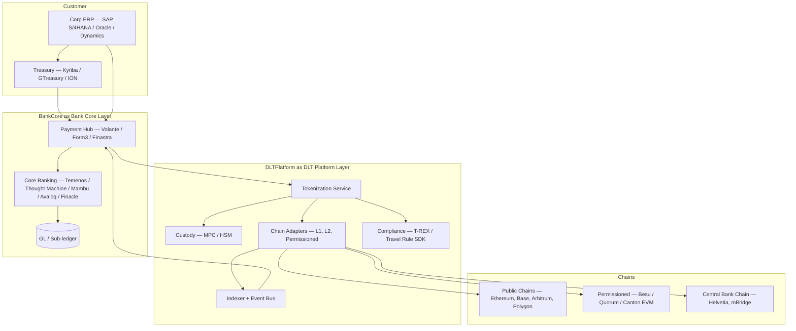

# 04 — Bank integration stack

How DLT rail plugs into existing core banking + ERP + TMS landscape.

## Logical view

## Integration patterns per stack component

### SAP S/4HANA

- **Inbound to chain**: SAP TRM (Treasury and Risk Management) generates payment, flows to bank via H2H or API; bank wraps as token tx
- **From chain to SAP**: chain events indexed → bank API → SAP via IDoc or pain.002 / camt.054
- **Patterns**: SAP DRC (Document and Reporting Compliance) for token reporting; Multi-Bank Connectivity for blockchain rail
- See [[integrations/sap-s4hana]]

### Oracle ERP / NetSuite

- Oracle Cash Management module accepts MT940/camt.053; bank generates from chain events
- AR auto-reconciliation matches structured-ref-in-memo on tokens
- Oracle Treasury module submits payments via standard bank file
- See [[integrations/oracle-erp]]

### Microsoft Dynamics 365 F&O

- Banking integration via Electronic Banking module
- DLT rail surfaces as another bank account / payment method
- See [[integrations/microsoft-dynamics]]

### Temenos T24 / Transact

- Payment Order Manager initiates token transfers via tokenization service API
- Account servicing posts token tx to mirror DDA
- See [[integrations/temenos]]

### Thought Machine Vault Core

- Smart contracts in Python (Vault language) define products
- Native DLT integration possible via contract extension
- Easier to expose token operations as Vault product
- See [[integrations/thought-machine]]

### Mambu

- API-first, easier to wrap DLT operations
- Tokenization service can be called from Mambu API
- See [[integrations/mambu]]

### Kyriba (TMS)

- Multi-bank connectivity already
- DLT rail = "another bank" with non-standard balance feeds (real-time chain indexer)
- See [[integrations/kyriba]]

### Payment hubs (Volante, Form3, Finastra)

- Can be extended with DLT adapter alongside SWIFT / SEPA / RTGS adapters
- Same orchestrator, new rail
- See [[integrations/volante]] · [[integrations/form3]] · [[integrations/finastra]]

## Common integration patterns

- **Mirror-account pattern**: bank holds 1:1 mirror DDA, every token op reflected in DDA
- **Direct ledger pattern**: token IS the deposit (only with tokenized deposit)
- **Sub-ledger pattern**: chain is sub-ledger, GL gets daily aggregate
- **Event-driven update**: indexer emits chain events → core banking reacts

## Cross-link

Compare incumbent integrations: [[../paycodex/03-tech-integration]] · [[../paycodex/architecture/sct-inst-physical-vendor-map]]

## Linked

[[integrations/README]] · [[architecture/tokenization-platform-pattern]]
