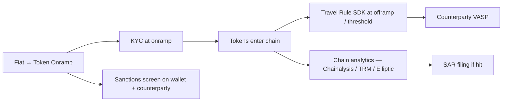
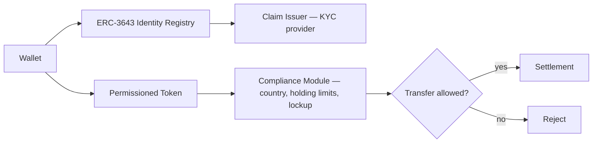

# 05 — Compliance stack

How AML, sanctions, KYC, Travel Rule, reporting work in DLT vs incumbent.

## Reg framework summary

| Reg | Applicability to DLT |
|---|---|
| [[../paycodex/regulations/mica]] | EU stablecoin issuance + CASP authorization |
| [[../paycodex/regulations/wtr-travel-rule]] | EU 2023/1113 — Travel Rule extended to crypto via 2023 recast; FATF R16 globally |
| [[../paycodex/regulations/amld-amlr-amla]] | Standard AML on CASPs |
| FINMA DLT Act (CH) | Ledger-based securities, DLT trading + CSD licence |
| EU DLT Pilot Regime | Sandbox for DLT-MTF + SS facility |
| BSA Travel Rule (US) | $3K threshold, FinCEN |
| OFAC sanctions | Tornado Cash 2022 precedent — smart contract addresses can be sanctioned |
| Basel III | RWA treatment of crypto (BCBS final rules Dec 2022, in force 2025) |

## Public chain compliance pattern

- KYC at onramp / offramp (CASP responsibility)
- Travel Rule SDK exchanges originator/beneficiary data between VASPs ≥ threshold
- Chain analytics monitors flows post-fact (transaction monitoring)
- Sanctions: screen wallet at onramp; some smart contracts include OFAC blocklist on transfer

## Permissioned chain compliance pattern

- Every wallet ↔ verified identity (ONCHAINID)
- Token transfer requires both sender + receiver have valid claims
- Transfer logic enforced on-chain (cannot bypass)
- See [[standards/erc-3643-trex]]

## Travel Rule on-chain

- IVMS-101 = standardized data format for originator/beneficiary
- Off-chain protocols: TRP (TRUST), Notabene, Sumsub, GTR, Veriscope
- Threshold: €1K (EU), $3K (US)
- Compliance: bilateral exchange between VASPs at transaction time
- See [[compliance/travel-rule-onchain]]

## Sanctions on-chain

- Issuer can freeze tokens (USDC has freeze function)
- Tornado Cash precedent (Aug 2022 OFAC) — smart contract addresses sanctionable
- Self-custody = bank cannot screen; rely on counterparty VASP
- AML rules = chain analytics post-fact; pre-tx screening at smart contract via lists

## Cross-link

Compare incumbent: [[../paycodex/07-risk-controls]] · [[../paycodex/concepts/ofac]] · [[../paycodex/concepts/kyc-aml]]

## Linked

[[compliance/travel-rule-onchain]] · [[compliance/trex-erc-3643]] · [[compliance/mica-eu]] · [[compliance/finma-dlt-act]] · [[compliance/eu-dlt-pilot-regime]]
