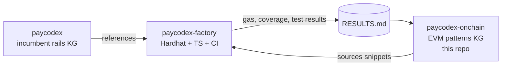

# Cash Management on DLT/EVM — Knowledge Graph

Open-source documentation graph for building cash management products on EVM-based distributed ledgers (permissioned + permissionless).

[](LICENSE) [](LICENSE-DOCS) []() []()

> Companion to [`paycodex`](https://github.com/) — same cash management products mapped onto DLT. Cross-linked.

## What this is

- **5 foundation notes** — DLT primer, EVM stack, cash legs comparison, bank integration, compliance
- **37 concept atoms** — Solidity, Hardhat, OpenZeppelin, AA, MPC, oracles, bridges, indexers, security patterns
- **12 ERC standards deep dives** — ERC-20, 721, 1155, 1400, 3643 (T-REX), 4626, 4337 (AA), 2535 (Diamond), 2612 (permit), 7281 (xERC20), 1967
- **15 platforms** — Ethereum L1, Base, Arbitrum, Optimism, zkSync, Polygon, Linea, Besu, Quorum, Canton EVM, Fabric, Corda
- **5 cash leg types** — stablecoin, tokenized deposit, wholesale CBDC, retail CBDC, tokenized MMF — full comparison matrix
- **14 bank integrations** — Temenos, SAP, Oracle, Microsoft Dynamics, Thought Machine, Mambu, Avaloq, Finacle, Kyriba, Volante, Form3, Finastra
- **9 compliance patterns** — Travel Rule on-chain, T-REX, MiCA, FINMA DLT Act, EU DLT Pilot Regime, Basel III crypto, OFAC on-chain
- **7 architecture patterns** — bank-DLT rail, tokenization platform, multi-chain treasury, permissioned-public bridge, atomic DvP, gasless paymaster
- **6 ADRs** — public vs permissioned, cash leg strategy, T-REX vs 1400, multi-chain, AA, build vs Tokeny
- **Top 100 ranked use cases** — easy → hard
- **24 runnable Solidity snippets** — Hardhat-compatible, OZ 5.x

## Quick start — run a snippet

```bash
git clone https://github.com/lopezpalacios/paycodex-onchain
cd paycodex-onchain

# Set up a Hardhat project
mkdir ../demo && cd ../demo
npm init -y
npm install --save-dev hardhat @nomicfoundation/hardhat-toolbox
npm install @openzeppelin/contracts
npx hardhat init   # pick "Create a TypeScript project"

# Copy reference config + a snippet + sample test
cp ../paycodex-onchain/code/hardhat.config.ts hardhat.config.ts
cp ../paycodex-onchain/code/01-erc20-transfer.sol contracts/
cp ../paycodex-onchain/code/sample.test.ts test/

# Build + test
npx hardhat compile
npx hardhat test
```

## Master prompt

[`prompt.md`](prompt.md) — self-contained reusable prompt for spinning up DLT-strategist discussions with any AI assistant.

## How to read

| Persona | Start here |
|---|---|
| DLT newcomer | [`01-dlt-fundamentals.md`](01-dlt-fundamentals.md) → [`02-evm-stack.md`](02-evm-stack.md) → use case 001 |
| Cash mgmt expert | [`03-cash-legs-comparison.md`](03-cash-legs-comparison.md) → pick adjacent use case |
| Engineer | [`code/README.md`](code/README.md) → run snippets in Hardhat |
| Architect | [`04-bank-integration-stack.md`](04-bank-integration-stack.md) → [`architecture/bank-dlt-rail-pattern.md`](architecture/bank-dlt-rail-pattern.md) |
| Compliance | [`05-compliance-stack.md`](05-compliance-stack.md) → [`compliance/`](compliance/) |
| Strategist | [`prompt.md`](prompt.md) + [`EXECUTIVE-DECK.md`](EXECUTIVE-DECK.md) |

## Executive overview

[`EXECUTIVE-DECK.md`](EXECUTIVE-DECK.md) — Marp-format slide deck. Render:

```bash
npm i -g @marp-team/marp-cli
marp EXECUTIVE-DECK.md --pptx -o exec.pptx
```

## Foundations

1. [`01-dlt-fundamentals.md`](01-dlt-fundamentals.md) — what is DLT, advantages vs incumbent rails
2. [`02-evm-stack.md`](02-evm-stack.md) — EVM, L1/L2/permissioned, tooling
3. [`03-cash-legs-comparison.md`](03-cash-legs-comparison.md) — **the four+1 types of money**
4. [`04-bank-integration-stack.md`](04-bank-integration-stack.md) — SAP / Oracle / Temenos / Thought Machine / Mambu / Kyriba / Volante
5. [`05-compliance-stack.md`](05-compliance-stack.md) — Travel Rule, T-REX, MiCA, FINMA DLT, EU DLT Pilot

## Top use cases with code

| # | Use case | Snippet |
|---|---|---|
| 001 | ERC-20 instant transfer | [`code/01-erc20-transfer.sol`](code/01-erc20-transfer.sol) |
| 002 | Transfer with structured ref (Swiss QR-bill equivalent) | [`code/02-erc20-transfer-with-memo.sol`](code/02-erc20-transfer-with-memo.sol) |
| 003 | Batch payroll | [`code/03-batch-transfer.sol`](code/03-batch-transfer.sol) |
| 004 | EIP-2612 permit (gasless approve) | [`code/04-erc20-permit.sol`](code/04-erc20-permit.sol) |
| 005 | Multi-recipient split | [`code/05-multi-recipient-split.sol`](code/05-multi-recipient-split.sol) |
| 006 | T-REX whitelist transfer | [`code/06-trex-whitelist-transfer.sol`](code/06-trex-whitelist-transfer.sol) |
| 007 | Balance aggregator | [`code/07-balance-read.sol`](code/07-balance-read.sol) |
| 008 | Tokenized deposit redeem | [`code/08-tokenized-deposit-redeem.sol`](code/08-tokenized-deposit-redeem.sol) |
| 009 | Tokenized deposit mint | [`code/09-tokenized-deposit-mint.sol`](code/09-tokenized-deposit-mint.sol) |
| 010 | OFAC sanctions blocklist | [`code/10-sanctions-blocklist.sol`](code/10-sanctions-blocklist.sol) |
| 011 | Atomic FX swap | [`code/11-atomic-fx-swap.sol`](code/11-atomic-fx-swap.sol) |
| 013 | Recurring payment (AA) | [`code/13-recurring-payment-aa.sol`](code/13-recurring-payment-aa.sol) |
| 014 | Direct debit mandate | [`code/14-direct-debit-mandate.sol`](code/14-direct-debit-mandate.sol) |
| 015 | Sweep keeper | [`code/15-sweep-contract.sol`](code/15-sweep-contract.sol) |
| 017 | ERC-4626 MMF vault | [`code/17-tokenized-mmf-vault.sol`](code/17-tokenized-mmf-vault.sol) |
| 018 | On-chain repo | [`code/18-repo-onchain.sol`](code/18-repo-onchain.sol) |
| 023 | Oracle conditional payment | [`code/23-conditional-payment-oracle.sol`](code/23-conditional-payment-oracle.sol) |
| 031 | Atomic DvP | [`code/31-atomic-dvp.sol`](code/31-atomic-dvp.sol) |
| 033 | Supply chain finance | [`code/33-scf-onchain.sol`](code/33-scf-onchain.sol) |
| 035 | Invoice NFT | [`code/35-invoice-tokenization.sol`](code/35-invoice-tokenization.sol) |
| 039 | Letter of credit | [`code/39-letter-of-credit.sol`](code/39-letter-of-credit.sol) |
| 051 | Cross-border USDC↔EURC | [`code/51-cross-border-usdc-eurc.sol`](code/51-cross-border-usdc-eurc.sol) |
| 069 | ESG-linked loan | [`code/69-esg-linked-loan.sol`](code/69-esg-linked-loan.sol) |

[Full top 100 catalog](use-cases/README.md)

## Cash legs — strategic frame

| Type | Issuer | Tier of money | Best for |
|---|---|---|---|
| **Stablecoin (public)** | Private EMI (regulated) | Tier 2 | DeFi treasury, FX, cross-border |
| **Tokenized deposit** | Licensed bank | Tier 2 | Interbank, in-house bank |
| **Wholesale CBDC** | Central bank | **Tier 1** | DvP wholesale, interbank settlement |
| **Retail CBDC** | Central bank | **Tier 1** | Retail consumer (when live) |
| **Tokenized MMF** | Asset manager | Investment | Idle cash yield |

[Full comparison matrix](cash-legs/comparison-matrix.md)


## Companion factory repo

[`paycodex-factory`](https://github.com/lopezpalacios/paycodex-factory) — runnable Hardhat project with the same snippets, TypeScript tests, gas reports, and GitHub Actions CI. Tested gas costs feed back into [code/RESULTS.md](https://github.com/lopezpalacios/paycodex-factory/blob/main/RESULTS.md).



## Companion incumbent graph

[`paycodex`](https://github.com/) — incumbent CH/EU/UK rails (SCT Inst, SDD, QR-bill, CHAPS, FPS, T2S DvP, etc.). Every use case here cross-links to its incumbent equivalent there.

## Stack

Solidity 0.8.20+ · Hardhat · TypeScript · ethers.js v6 · OpenZeppelin 5.x · Ethereum L1 + Base + Arbitrum + Polygon · Hyperledger Besu (permissioned) · Tokeny T-REX · Chainlink oracles · Notabene Travel Rule

## Contributing

See [CONTRIBUTING.md](CONTRIBUTING.md).

## License

- **Code** (Solidity, scripts) — [MIT](LICENSE)
- **Documentation** (markdown) — [CC-BY-SA-4.0](LICENSE-DOCS)
