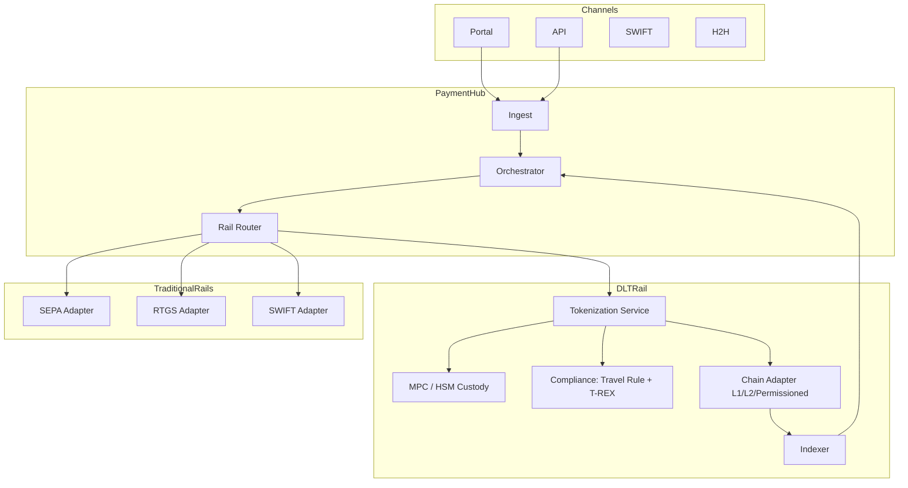

# Bank-side DLT rail pattern

How an existing bank adds DLT as another rail alongside SCT Inst, SIC, CHAPS, SWIFT.

## Logical view



## Rail router decision

```python
def route_payment(payment):
    if payment.eligible_dlt() and payment.customer.dlt_enabled():
        return "DLT"
    if payment.amount > RTGS_THRESHOLD or payment.urgent:
        return "RTGS"  # T2 / SIC / CHAPS
    if payment.currency == "EUR" and payment.instant:
        return "SCT_INST"
    if payment.cross_border:
        return "SWIFT"
    return "SCT"  # batch SEPA
```

## DLT eligibility criteria

- Both customer + counterparty have DLT-enabled wallet
- Currency available as token (stablecoin, tokenized deposit, wholesale CBDC)
- Travel Rule data available for ≥ threshold
- Sanctions screening passes
- Cost (gas) reasonable

## Linked

[[../paycodex/architecture/sct-inst-logical]] · [[tokenization-platform-pattern]] · [[multi-chain-treasury-pattern]]
