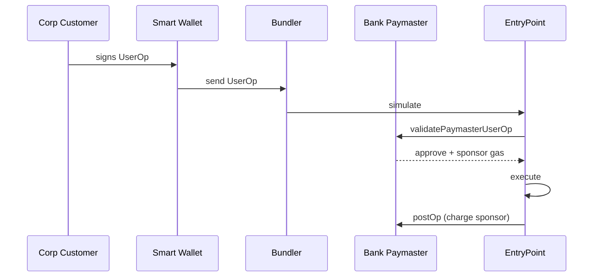

# Gasless paymaster pattern

Bank sponsors gas for corporate customer transactions. Customer doesn't hold native token.

## ERC-4337 paymaster

## Why for cash mgmt

- Corp customer no need to hold ETH
- Bank charges gas as fee in account analysis ([[../paycodex/concepts/account-analysis]])
- Simplifies UX dramatically

## Implementation

- Paymaster contract whitelist customer wallets
- Per-customer monthly gas budget
- Per-tx caps to prevent abuse

## Linked

[[../standards/erc-4337]] · [[../use-cases/020-account-abstraction-treasury-wallet]]
