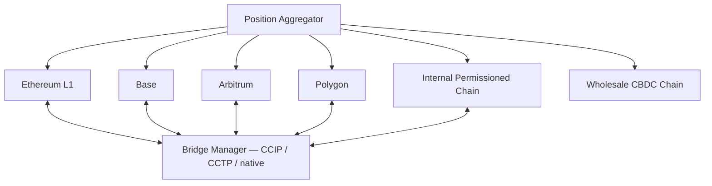

# Multi-chain treasury pattern

Bank treasury holds tokenized assets across L1, multiple L2s, permissioned chains. Manage as unified portfolio.

## Components

## Position aggregation

- Real-time per-chain balance
- Normalized to common denomination (e.g., USDC equivalents)
- Net position view across chains
- Yield position view (where treasury holds 4626 vault shares)

## Bridging strategy

- Use Circle CCTP for USDC across chains (native, no wrapping)
- LayerZero / xERC20 for proprietary tokens
- CCIP for diversification

## Yield / liquidity strategy

- Idle USDC → BUIDL on Ethereum
- Working capital → high-velocity chain (Base / Arbitrum)
- Long-term reserves → permissioned chain

## Linked

[[bank-dlt-rail-pattern]] · [[../concepts/circle-cctp]] · [[permissioned-public-bridge-pattern]]
