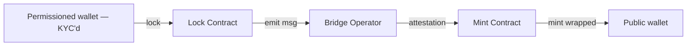

# Permissioned ↔ Public bridge pattern

Bank uses permissioned chain for KYC'd interbank settlement, public chain for wider liquidity.

## Pattern

## Key challenges

- KYC'd permissioned-side party — public side may not be
- Privacy: permissioned-side identities not exposed
- Compliance: Travel Rule applies on public side
- Reverse: public → permissioned requires KYC at bridge

## Use case

- Bank's tokenized deposit settles bilaterally on permissioned chain
- For public chain DeFi yield, bridge to wrapped form
- Reverse on redemption

## Risks

- Bridge = central point of failure (most bridge hacks: Wormhole, Ronin, Nomad)
- Mitigations: short-term lockup, multi-sig with timelock, insurance

## Linked

[[multi-chain-treasury-pattern]] · [[../concepts/circle-cctp]]
