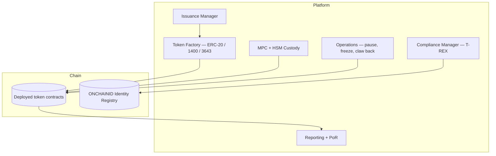

# Tokenization platform pattern

Multi-token issuer platform. Issues + manages tokenized deposits, securities, MMF tokens.

## Components

## Typical tokens managed

- Tokenized deposit (per CCY)
- Tokenized fund unit (ERC-4626)
- Tokenized bond (ERC-1400 / 3643)
- Tokenized commercial paper
- Tokenized invoice (ERC-721 / 1155)

## Lifecycle ops

- Issue (mint)
- Redeem (burn)
- Pause (regulatory event)
- Freeze (per address)
- Claw back (court order)
- Upgrade (Diamond / UUPS)

## Vendor / build

- Build: Hardhat + OpenZeppelin + custom
- Buy: Tokeny (T-REX), Securitize, Fireblocks Tokenization, Onyx (JPM internal)

## Linked

[[bank-dlt-rail-pattern]] · [[../standards/erc-3643-trex]] · [[../standards/erc-1400]]
