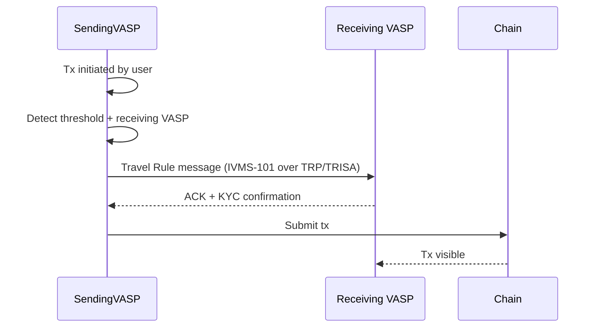

# Travel Rule on-chain

FATF Recommendation 16 + EU Reg 2023/1113. Originator + beneficiary info must travel with payment ≥ threshold.

## Threshold

- EU: €1,000
- US: $3,000
- Some jurisdictions: $1,000 (FATF baseline)

## Standard data

IVMS-101 (Inter-VASP Messaging Standard):

- Originator name, address, account / wallet
- Originator ID (DOB + national ID)
- Beneficiary name, account / wallet
- Optional: purpose, geographic info

## Protocols

| Protocol | Description |
|---|---|
| **TRP / TRUST** | Bank-led standard, used by Notabene partners |
| **TRISA** | Open protocol, mTLS-based |
| **OpenVASP** | Decentralized, less adoption |
| **GTR** | Sumsub network |

## Vendors

- **Notabene** — biggest standalone, EU-strong
- **Sumsub** — broader compliance suite + Travel Rule
- **TRM Labs** — analytics + Travel Rule
- **Veriscope** | **Shyft** — alternatives

## Implementation

## Self-custody / unhosted wallet

- EU: VASP must collect self-declaration of beneficial owner
- US: equivalent due diligence, especially for high-risk
- Major friction point — Tornado-Cash-style mixers may have receiving wallets

## Linked

[[../paycodex/regulations/wtr-travel-rule]] · [[bsa-travel-rule]]
