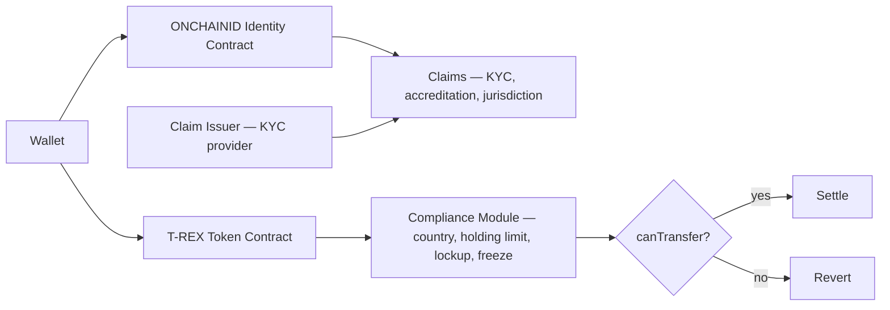

# T-REX (ERC-3643) — Token for Regulated Exchange

Compliance framework for permissioned tokens. Identity + transfer rules on-chain.

## Components

## Compliance modules (composable)

- **CountryAllowModule** — only allow transfer between specified countries
- **MaxBalanceModule** — cap per-wallet holding
- **TimeLockedTransferModule** — lockup post-issuance
- **TransferFeesModule** — fee on transfer
- **ConditionalTransferModule** — pre-approval required

## Comparison

| | Stablecoin (USDC) | T-REX permissioned |
|---|---|---|
| KYC enforcement | Off-chain at onramp | On-chain pre-tx |
| Freeze / blacklist | Issuer admin keys (post-fact) | canTransfer (pre-fact) |
| Audit | Reserve attestation | Compliance log on-chain |
| Permissionless DeFi | Yes | No |
| Reg posture | Blacklist-based | Whitelist-based |

## Implementations

- Tokeny (LU) — leading T-REX provider
- Used by 100+ tokenization projects globally
- Standard finalized 2023

## Linked

[[../standards/erc-3643-trex]] · [[../concepts/onchainid]] · [[../cash-legs/tokenized-deposit]]
