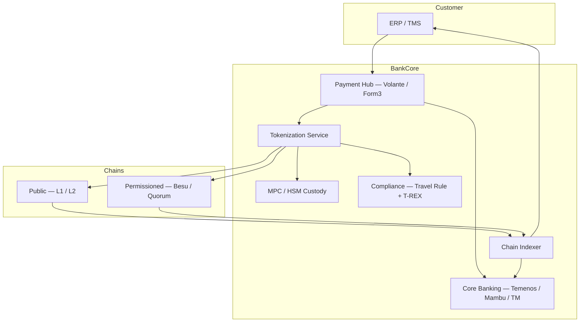

# Core banking tokenization integration pattern

Generic pattern for plugging DLT rail into core banking + ERP.

## Logical components

## Three integration strategies

### 1. Mirror-account pattern

- DLT wallet ↔ DDA mirror 1:1
- Every chain tx → DDA debit/credit
- Customer sees both sides
- Best for early pilot — all reporting flows through DDA legacy paths

### 2. Direct ledger pattern

- DLT wallet IS the customer balance
- No mirror DDA
- Only with tokenized deposit (token = legal claim)
- Cleanest, more disruptive to ops

### 3. Sub-ledger pattern

- Chain = sub-ledger of GL
- GL aggregates daily
- Mid-step between mirror + direct

## Reconciliation

- Chain indexer + DDA must always tie out
- Daily recon at minimum
- Critical regulator focus — pre-Synapse-style segregation discipline

## Linked

[[temenos]] · [[../04-bank-integration-stack]] · [[../paycodex/architecture/sct-inst-physical-vendor-map]]
