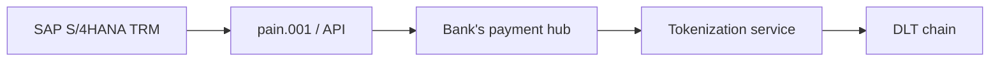

# SAP S/4HANA + DLT

Integration patterns for SAP corporate users.

## Outbound (corp pays via DLT)

- SAP TRM (Treasury Risk Mgmt) generates payment as standard ISO 20022 pain.001
- Bank intercepts at hub → routes to DLT adapter instead of SEPA / SWIFT
- Adapter:
  - Resolves recipient wallet (lookup or pre-registered)
  - Calls token transfer
  - Returns pain.002 + UETR-equivalent (chain tx hash)

## Inbound (corp receives via DLT)

- Indexer watches corp's DLT wallet
- On incoming tx: bank generates camt.054 + camt.053
- SAP imports as standard bank statement
- Auto-recon via [[../paycodex/processes/ar-reconciliation]] cascade

## SAP-specific gotchas

- SAP DRC (Document and Reporting Compliance) needs token tx classified for VAT / reporting
- Multi-Bank Connectivity (MBC) treats DLT rail as another bank

## Vendors

- SAP partners: SAP Treasury blockchain proof-of-concepts (with consortium banks)
- 3rd party: Taulia (SCF), Coupa (treasury) integrate via APIs

## Linked

[[../04-bank-integration-stack]] · [[oracle-erp]]
