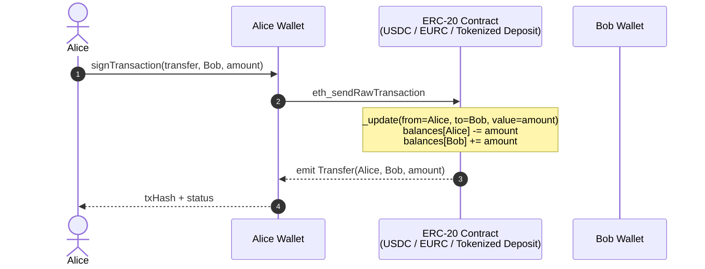

# 001 — ERC-20 instant transfer

**Tier**: 1 — Easiest
**Incumbent**: [[../../paycodex/concepts/sct-inst]] · [[../../paycodex/concepts/fps]]
**ERC**: ERC-20 (any cash leg implementing it)
**Code**: [[../code/01-erc20-transfer.sol]]
**Factory contract**: [paycodex-factory/contracts/01-erc20-transfer.sol](https://github.com/lopezpalacios/paycodex-factory/blob/main/contracts/01-erc20-transfer.sol) · [test](https://github.com/lopezpalacios/paycodex-factory/blob/main/test/01-bank-token.test.ts) · gas: 53,792 (transfer) / 73,160 (mint)

## What

Send X token from A to B. Atomic, irrevocable, ~1-12s finality depending on chain.

## Sequence

## Vs incumbent SCT Inst

| | SCT Inst | ERC-20 transfer |
|---|---|---|
| Hours | 24/7 (post-IPR Oct 2025) | 24/7 always |
| SLA | <10s | <12s on L2, <12min on L1 |
| Limit | No scheme cap (PSP discretion) | Block-size dependent |
| Cost | €0.05-€0.30 | $0.001-$5 (chain-dependent) |
| VOP / pre-validation | Mandatory Oct 2025 | Address book pattern, ENS lookup |
| Sanctions | Daily customer screening | Pre-tx wallet screening |

## Code

See [[../code/01-erc20-transfer.sol]].

## Reg considerations

- KYC at issuance handles customer identification
- Travel Rule applies if amount ≥ €1k EU / $3k US between VASPs
- Sanctions: pre-tx address screening via [[../compliance/ofac-onchain-screening]]

## Linked

[[002-erc20-transfer-with-memo]] · [[../code/01-erc20-transfer.sol]] · [[../../paycodex/concepts/sct-inst]]
