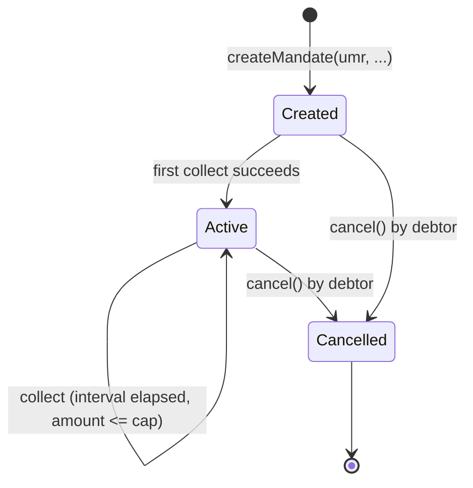
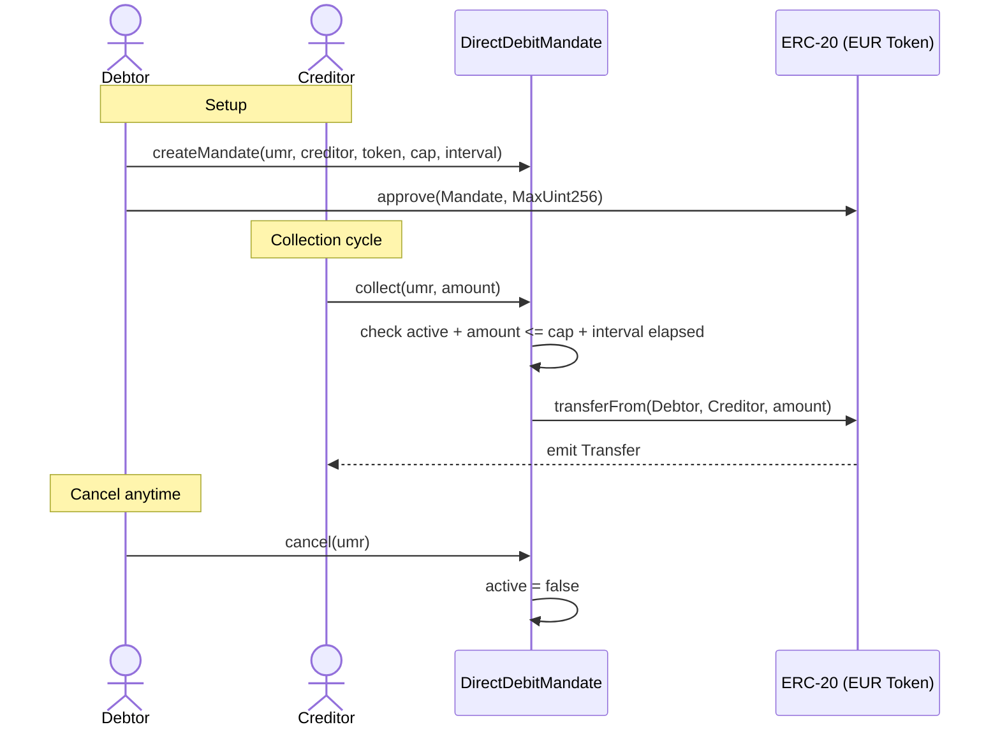

# 014 — Direct debit mandate

**Tier**: 2 — Moderate
**Incumbent**: [[../../paycodex/concepts/sepa-mandate]] · [[../../paycodex/processes/sdd-mandate-lifecycle]]
**ERC**: ERC-20 + custom auth contract
**Code**: [[../code/14-direct-debit-mandate.sol]]
**Factory contract**: [paycodex-factory/contracts/14-direct-debit-mandate.sol](https://github.com/lopezpalacios/paycodex-factory/blob/main/contracts/14-direct-debit-mandate.sol) · gas: 160,881 (createMandate) / 77,150 (collect avg) / 25,462 (cancel)

## What

SEPA SDD-style mandate as smart contract. Debtor authorizes creditor to pull capped amount per interval. Cancellable anytime by debtor.

## Mandate lifecycle (state machine)

## Collection sequence

## Vs incumbent SDD Core

| | SEPA SDD Core | Smart contract mandate |
|---|---|---|
| Mandate storage | Per creditor + audit | On-chain in contract state |
| UMR | Creditor-assigned string | bytes32 hash |
| Pre-notification | ≥14 days (or agreed) | Application layer |
| Refund right | 8 weeks no-q, 13m unauthorized | None on-chain (off-chain dispute) |
| Cancellation | Debtor's bank (ADDACS) | On-chain `cancel()` |
| Interval enforcement | Off-chain (creditor responsibility) | On-chain (interval check) |

## Risk: 8-week refund

The smart contract has NO refund mechanism — debtor's protection becomes off-chain dispute or oracle-arbitrated escrow. For B2B (no scheme refund right), this is fine. For consumer use, would need refund window contract or hybrid.

## Code

See [[../code/14-direct-debit-mandate.sol]].

## Linked

[[../../paycodex/concepts/sepa-mandate]] · [[../../paycodex/concepts/sepa-sdd]] · [[../../paycodex/states/mandate-lifecycle]] · [[../code/14-direct-debit-mandate.sol]]
