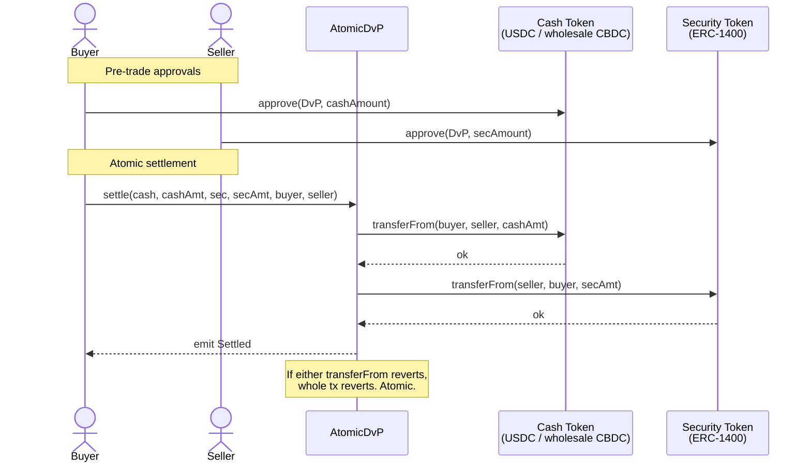
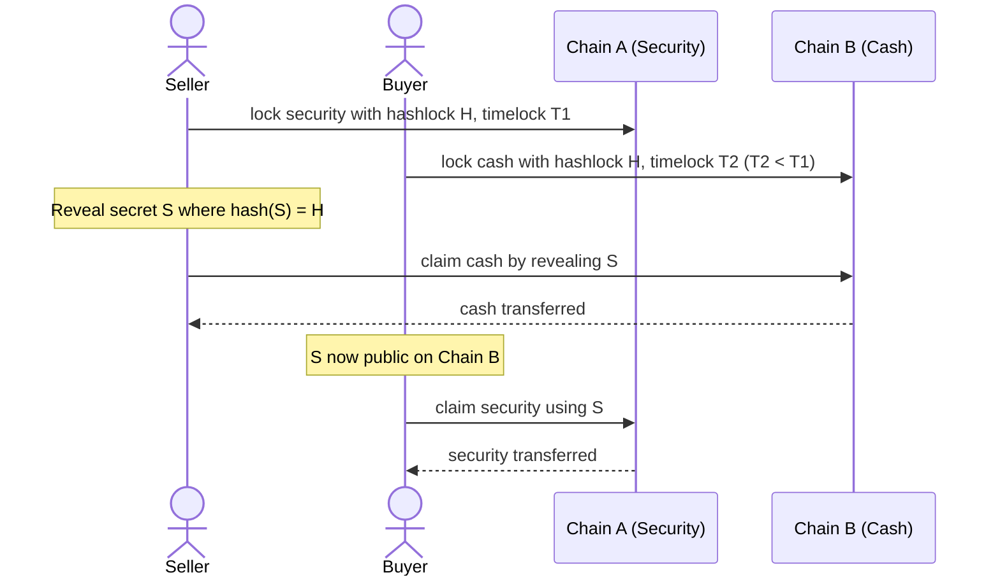

# 031 — Atomic DvP (Delivery vs Payment)

**Tier**: 3 — Intermediate
**Incumbent**: [[../../paycodex/processes/securities-cash-leg]] · [[../../paycodex/concepts/dvp]] · [[../../paycodex/concepts/t2s]]
**ERC**: ERC-20 (cash) + ERC-20-compatible security (or ERC-1400 wrapper)
**Code**: [[../code/31-atomic-dvp.sol]]
**Factory contract**: [paycodex-factory/contracts/31-atomic-dvp.sol](https://github.com/lopezpalacios/paycodex-factory/blob/main/contracts/31-atomic-dvp.sol) · deploy gas: 217,672

## What

Atomic single-tx settlement of securities transfer + cash transfer. Either both legs succeed or neither. Equivalent to T2S DvP Model 1.

## Vs T2S DvP

| | T2S DvP | On-chain Atomic DvP |
|---|---|---|
| Settlement model | Gross-gross via T2S platform | Atomic via single tx |
| Cash leg | DCA at NCB | ERC-20 (CBDC / tokenized deposit / stablecoin) |
| Securities leg | CSD ledger | ERC-20-compatible / ERC-1400 |
| Operating hours | T2 cycle | 24/7 |
| Failure penalty | CSDR cash penalty (post-ISD) | None — either settled instantly or never |
| Pre-matching | Required | Not needed (counterparty must approve) |

## Sequence

## Cross-chain DvP

When security and cash live on different chains, atomic DvP needs HTLC (Hash Time Locked Contract):

If either party doesn't act within timelocks, locks expire — funds returned. Atomic without trust.

## Linked

[[../../paycodex/processes/securities-cash-leg]] · [[../../paycodex/concepts/dvp]] · [[../code/31-atomic-dvp.sol]]
